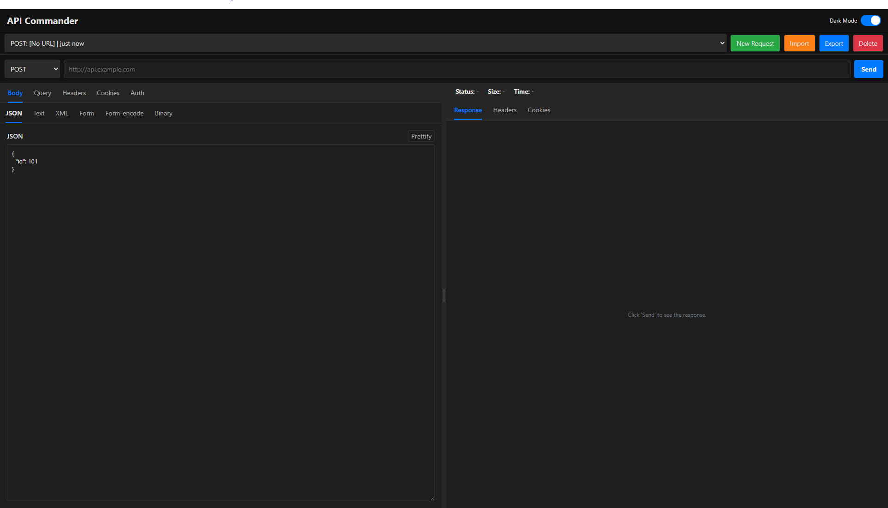

  

# API Commander

## Project Overview

  

**API Commander** is a versatile and minimalistic cross-platform API client designed for sending and managing HTTP requests. It provides a consistent experience across multiple environments, allowing developers to test and debug APIs directly from their preferred workspace.

The project is comprised of three main components: a VS Code extension, a Chrome extension, and a desktop application built with NodeGui.

---

## Features

### Cross-Platform API Client

- **Versatile Request Types:** Send requests with various body types including JSON, text, XML, Form Data, and URL-encoded forms.
- **Authentication Support:** Configure requests with different authentication methods such as None, Basic, and Bearer Token. The application is also structured to support OAuth2 and AWS Signature Version 4.
- **Session Management:** Save, load, and manage API request sessions. You can also import and export sessions for easy sharing.
- **Customization:** Set query parameters, headers, and cookies for your requests.
- **History:** The application automatically saves a history of your API calls, making it easy to revisit past requests.

### VS Code Extension

- **Integrated Sidebar:** The extension adds a dedicated view to the VS Code sidebar for managing your API request history.
- **History Management:**
  - **New Request:** Start a new request directly from the sidebar.
  - **Refresh History:** Manually refresh the history list.
  - **Clear History:** Clear all saved API history with a single command.
  - **Import/Export:** Import and export request sessions.
- **Dedicated Panel:** Open a new panel to create and send requests.

### Chrome Extension

- **Context Menu Integration:** Right-click anywhere on a webpage and select "Open API Commander" to launch the application in a new tab.
- **DevTools Panel:** The extension creates a custom panel within Chrome DevTools for API testing.

### NodeGui Desktop App

- **Standalone Application:** Run API Commander as a native desktop application.
- **Persistent Storage:** Sessions are saved to a local database, ensuring your data is preserved between sessions.
- **UI Customization:** Toggle between dark mode and light mode.

---

## Installation and Usage

### VS Code Extension

1.  Open VS Code.
2.  Navigate to the Extensions view (`Ctrl+Shift+X` or `Cmd+Shift+X`).
3.  Search for "API Commander".
4.  Click **Install**.
5.  After installation, a new "API Commander" icon will appear in the sidebar. Click it to view your history or start a new request.

### Chrome Extension

1.  Open Chrome.
2.  Go to `chrome://extensions`.
3.  Click **Load unpacked** and select the folder containing the extension files.
4.  The extension will appear in your toolbar. You can also access it by right-clicking on a webpage and selecting "Open API Commander".

### NodeGui Desktop App

1.  Ensure you have Node.js installed.
2.  Navigate to the project directory in your terminal.
3.  Install the required dependencies by running `npm install`.
4.  To run the application, use the command `npm start` (if configured in `package.json`) or `node .`.

---

## Technologies Used

- **VS Code Extension:** VS Code API, Node.js, HTML/CSS/JavaScript for the webview UI.
- **Chrome Extension:** Chrome Extension API, JavaScript, HTML.
- **Desktop App:** NodeGui, Node.js, and a number of libraries including `axios`, `node-fetch`, `aws4`, and `form-data`.
- **Storage:** `KVStore` is used for desktop session storage, while the VS Code global state is used for the extension's history.
