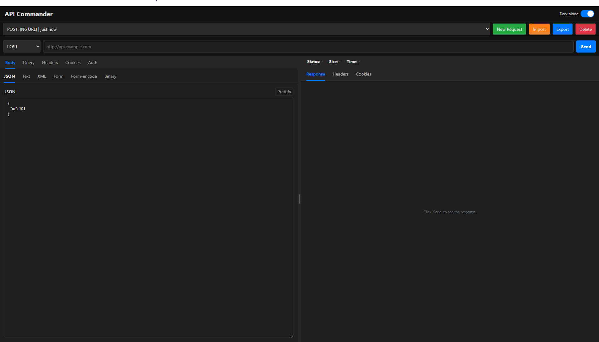

  

# API Commander: A Minimalistic VS Code Extension for API Requests

  

## Description

API Commander is a minimalistic VS Code extension designed to help you send and manage API requests directly within the editor. It allows you to create new requests, manage a history of previous requests, and handle various request types.

---

## Features

- **Send API Requests:** The extension provides a user interface to send API requests with different methods (POST, GET, PUT, PATCH, DELETE, HEAD, OPTIONS) and configure request details like query parameters, headers, cookies, and authentication.
- **Request History:** It automatically saves your API requests to a history, which is displayed in a sidebar tree view.
- **Manage Sessions:** You can manage your API requests (sessions) from the main panel, which includes buttons to create a new request, import a session from a JSON file, export a session, and delete the current session.
- **View Responses:** The extension displays the response status, size, and time, and allows you to view the response body, headers, and cookies.
- **Import/Export:** You can import a session from a JSON file or export a session to a JSON file.
- **Side Panel Commands:** The side panel includes commands for creating a new request, refreshing the history, and importing sessions. Individual history items can also be run, exported, or deleted directly from the context menu in the side panel.
- **Clear History:** There is a command to clear all API history.

---

## Commands

You can access the main features of the extension through the Command Palette (`Ctrl+Shift+P` or `Cmd+Shift+P`).

- `Open API Commander`: Opens the main panel.
- `New Request`: Creates a new API request panel.
- `Refresh API History`: Refreshes the request history view in the sidebar.
- `Clear All API History`: Deletes all saved requests from your history.
- `Import Session`: Imports an API session from a JSON file.
- `Export Session from History`: Exports a specific request from history to a JSON file.
- `Delete Request from History`: Deletes a specific request from history.
- `Run from History`: Loads and runs a request from history.

---

## How to Use

1.  Open the API Commander panel from the Command Palette (`Ctrl+Shift+P`) by searching for "Open API Commander" or by clicking on the API Commander icon in the activity bar.
2.  In the main panel, enter your API endpoint URL and select the HTTP method from the dropdown.
3.  Use the tabs to configure your request:
    - **Body:** Configure the request body, including JSON, text, or form data.
    - **Query:** Add or remove query parameters.
    - **Headers:** Add or remove headers.
    - **Cookies:** Add or remove cookies.
    - **Auth:** Configure authentication types, such as Basic or Bearer Token.
4.  Click the **"Send"** button to execute the request.
5.  The response will appear in the right-hand panel, showing the status, size, and time of the response. You can switch between the Response Body, Headers, and Cookies tabs to view the details.
6.  Your request will be saved to the history, which you can access from the sidebar. You can right-click on a history item to run, export, or delete it.
7.  To create a new request, click the **"New Request"** button in the session bar or use the command from the Command Palette.
